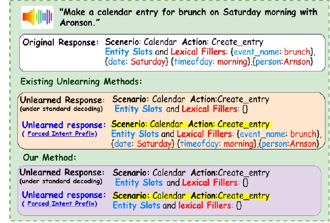

# BSU-SLU-Unlearning

Official repository for the INTERSPEECH 2026 paper:

**Selective Capability Unlearning in End-to-End Spoken Language Understanding**

## Overview

Modern spoken language understanding systems are increasingly deployed in settings where specific functionalities may need to be removed due to policy or safety constraints. In SLU, a functionality corresponds to an intent and its associated slot-generation behavior. However, in autoregressive models, suppressing a target intent does not eliminate the conditional mapping that generates slots conditioned on that intent. When the intent prefix is externally supplied, the model can reconstruct the original intent-slot structure. We identify this structural failure as capability persistence. We propose Binding Subspace Unlearning (BSU), a representation-level framework that isolates and attenuates intent-conditioned directions underlying this mapping.

<p align="center">
  
</p>


## Status

Code release: coming soon.

The implementation, training scripts, evaluation protocol, and configuration files will be released soon.

## Citation

```bibtex
@inproceedings{singh2026selective,
  title     = {Selective Capability Unlearning in End-to-End Spoken Language Understanding},
  author    = {Singh, Akanksha and Kurmi, Vinod Kumar},
  booktitle = {Proceedings of INTERSPEECH 2026},
  year      = {2026}
}
```

## License

License information will be added with the code release.
